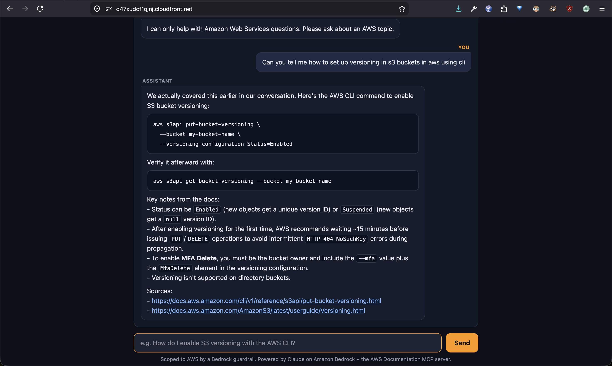
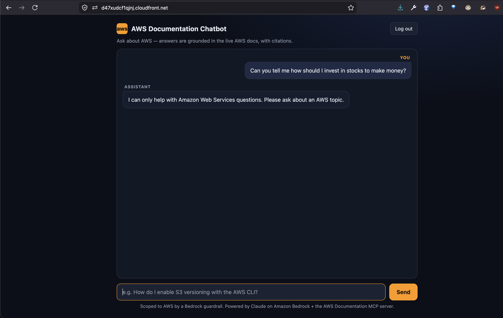

# Agentic AWS Documentation Chatbot

A serverless chatbot that answers AWS questions in natural language by **reasoning over the
live AWS documentation**. A Claude agent on Amazon Bedrock (Sonnet 4.6 by default on the deployed
path for latency; Opus 4.8 is a one-variable swap) calls the official
[awslabs AWS Documentation MCP server](https://github.com/awslabs/mcp) as a tool — it searches
and reads real AWS docs at query time and answers **with citations**, rather than relying on the
model's training memory. Everything is Infrastructure-as-Code (Terraform).

```
Browser ─▶ CloudFront ─▶ API Gateway (HTTP) ─▶ Lambda (container)
                                                    │  Strands agent loop (≤3 tool calls/turn)
                                                    ├─ Claude on Bedrock (Sonnet 4.6 default)
                                                    └─ AWS-Docs MCP server (stdio, in-image) ─▶ docs.aws.amazon.com
                                                    │
                                            DynamoDB (history)   Cognito (auth, JWT verified in-handler)
```

## Screenshots

| Grounded answer with citations | AWS-scoped by a Bedrock guardrail |
| --- | --- |
|  |  |
| The agent searches/reads the live docs, then answers with rendered code blocks and **clickable `docs.aws.amazon.com` sources**. | An off-topic question (_"how should I invest in stocks?"_) gets the scoped refusal — answers stay on AWS. |

## Features

- **Answers grounded in live AWS docs, with citations** — every reply is built from pages the agent
  fetched at query time (via the AWS-Docs MCP server) and ends with the source URLs, not the model's
  training memory.
- **Genuinely agentic** — Claude decides when to `search_documentation` / `read_documentation` and
  iterates; the tool calls are visible in CloudWatch (proof it isn't answering from memory).
- **AWS-scoped & safe** — a Bedrock Guardrail keeps it on AWS topics, filters unsafe content /
  prompt-injection, and redacts PII on every invocation.
- **Polished chat UI** — dark, AWS-accented interface with message bubbles, a "thinking" indicator,
  and client-side **markdown rendering** (code blocks, inline code, auto-linked citations).
- **Multi-turn memory that survives refresh** — history is persisted in DynamoDB per session and
  rehydrated on page load; a **New chat** button starts a fresh session.
- **Authenticated** — Cognito Hosted UI login; the JWT is verified in-handler before the agent runs.
- **Latency-guarded** — Sonnet 4.6 with a hard cap of 3 tool calls/turn and token limits keep
  answers within the deployed timeout (Opus 4.8 is a one-variable swap).
- **100% Infrastructure-as-Code** — Terraform provisions every resource (ECR, Lambda, API Gateway,
  CloudFront, Cognito, DynamoDB, Guardrail, IAM, observability) with GitHub Actions CI.

## Try the live demo

- **URL:** https://d47xudcf1qjnj.cloudfront.net  (AWS account 315311531132 / us-east-1)
- **Sign in:** click **Log in** → Cognito Hosted UI → use the demo account:
  - **Username:** `demo@example.com`
  - **Password:** _shared separately with the assignment submission_ (kept out of this public repo)
- **Ask something AWS:** answers stream back with **clickable `docs.aws.amazon.com` citations**, e.g.
  - _"How do I enable S3 bucket versioning with the AWS CLI?"_
  - _"What's the difference between an IAM role and an IAM user?"_
  - _"How do I set a Lambda function's timeout in Terraform?"_
- **Watch the guardrail:** ask something off-topic (_"What stock should I buy?"_) and the Bedrock
  guardrail replies _"I can only help with Amazon Web Services questions."_ — proof answers are
  scoped to AWS, not the model free-styling.

> Sessions are per-browser (a `session_id` in `localStorage`), so the bot remembers earlier turns in
> the same conversation. **Log out** clears the token; use it to test the auth flow.

> **Ingress note:** the design targets a streaming **Lambda Function URL** (no API Gateway 29s cap).
> The shared exam account blocks Function URL invocation via an org guardrail, so the deployed path
> uses **API Gateway** (buffered, 30s cap) instead. The Function URL design is preferred in an
> unrestricted account; both are in the Terraform (the `apigw` module is the active ingress).

See [docs/architecture.md](docs/architecture.md) for the full design, request flow, and
alternatives considered.

## Why this design
- **Live docs, not stale RAG** — the AWS-Docs MCP server fetches current documentation per query;
  no ingestion pipeline to build or keep fresh.
- **Genuinely agentic** — the model decides when to `search_documentation` / `read_documentation`
  and iterates; tool calls are visible in logs (proof it isn't answering from memory).
- **Production-grade serverless** — CloudFront + API Gateway + container Lambda, Cognito auth,
  DynamoDB session state, least-privilege IAM, a Bedrock Guardrail (AWS-topic scoping + content
  filters + PII redaction), observability + budget alarm — all in Terraform, with GitHub Actions CI.

## Quickstart (local)
```bash
cp .env.example .env          # set AWS_PROFILE + region (no secrets stored)
make install                  # venv (py3.12) + deps
make smoke                    # Bedrock converse check (confirms model access)
make dev                      # FastAPI chat server on :8080
# then:
curl -N localhost:8080/api/chat -H 'content-type: application/json' \
  -d '{"session_id":"s1","message":"How do I enable S3 versioning with the AWS CLI?"}'
```

## Layout
```
backend/    FastAPI app (Strands agent + MCP client + Bedrock) — runs locally and on Lambda
infra/      Terraform: modules/{ecr,lambda,apigw,cognito,dynamodb,guardrail,frontend,observability}
            + envs/dev. The chat UI is modules/frontend/assets/index.html.tftpl (templated → S3).
docs/       architecture + rationale
```

## Configuration
All via env (see `.env.example`): `BEDROCK_MODEL_ID` (default the Opus 4.8 global inference
profile), `AWS_REGION`, `AGENT_MAX_TOKENS`/`AGENT_MAX_TOOL_ITERATIONS` (cost/latency guards),
`CONVERSATIONS_TABLE` (DynamoDB; empty = in-memory for local), `AUTH_ENABLED` + Cognito ids.

## Deploying & updating

Terraform provisions **all infrastructure**, but it pins the Lambda to the `…:latest` image **tag**,
so it does not build/push the image or redeploy code on its own. The flows:

**First-time deploy** (or fresh account)
```bash
# 0. one-time bootstrap (state backend lives outside this stack, by design):
#    create S3 bucket yy-awsdocs-tfstate-<acct> + DynamoDB lock table yy-awsdocs-tflock
# 1. secrets/config:
cp .env.example .env                       # set AWS_PROFILE, AWS_REGION
echo 'TF_VAR_demo_password=<pick-one>' >> .env   # demo user password (gitignored)
# 2. build + push the container image so the Lambda has something to run:
set -a; source .env; set +a
REPO=$(cd infra/envs/dev && terraform output -raw ecr_repository_url 2>/dev/null || echo "<after first apply>")
aws ecr get-login-password | docker login --username AWS --password-stdin "${REPO%/*}"
docker build --platform linux/amd64 -t "${REPO}:latest" backend && docker push "${REPO}:latest"
# 3. apply. Cognito callback URLs need the CloudFront domain, so it's a two-pass apply:
make tf-apply                              # 1st pass creates CloudFront
#   → copy the app_url into infra/envs/dev/dev.tfvars (callback_urls / logout_urls)
make tf-apply                              # 2nd pass wires Cognito to the real URL
```

**Ship a backend code change** (Terraform won't notice a same-tag image)
```bash
set -a; source .env; set +a
REPO=315311531132.dkr.ecr.us-east-1.amazonaws.com/yy-awsdocs-backend
docker build --platform linux/amd64 -t "${REPO}:latest" backend && docker push "${REPO}:latest"
aws lambda update-function-code --function-name yy-awsdocs-api --image-uri "${REPO}:latest"
```

**Ship a frontend change** (the UI is an S3 object behind CloudFront)
```bash
make tf-apply                              # re-uploads index.html (etag is content-hashed)
aws cloudfront create-invalidation --distribution-id <id> --paths "/" "/index.html"
```

> CI (`.github/workflows/ci.yml`) gates every PR with ruff + pytest + `terraform validate` (no AWS
> creds). `deploy.yml` automates the build/push/apply above via GitHub OIDC; if the account blocks
> the OIDC provider, use the local commands here. ⚠️ In zsh write `${REPO}:latest` (braces) — bare
> `$REPO:latest` triggers the `:l` history modifier and silently mangles the tag.

## Cost
On-demand only: Bedrock per-token (Opus 4.8), Lambda per-invocation, DynamoDB on-demand,
CloudFront/S3 negligible at rest. A Budgets alarm is provisioned. `make tf-destroy` tears it down.

## Status
- [x] **M0** — account verified (315311531132 / us-east-1), permissions probed, Bedrock access confirmed
- [x] **M1** — agent core: Bedrock + AWS-Docs MCP, streaming, multi-turn memory, tests (local-first)
- [x] **M2** — deployed: ECR/Lambda, API Gateway, DynamoDB, Cognito, CloudFront, IAM, observability;
  end-to-end authenticated chat verified live (Function URL → API Gateway pivot due to org guardrail)
- [x] **M3** — polish: Bedrock Guardrail (AWS-topic scoping + content/PII filters) applied on every
  invocation and verified live; GitHub Actions CI (lint + test + `terraform validate`) + manual
  OIDC deploy workflow

> Runs in a **shared exam account** — every resource is namespaced `yy-awsdocs-*` and only
> self-created resources are touched. See [docs/architecture.md](docs/architecture.md).
